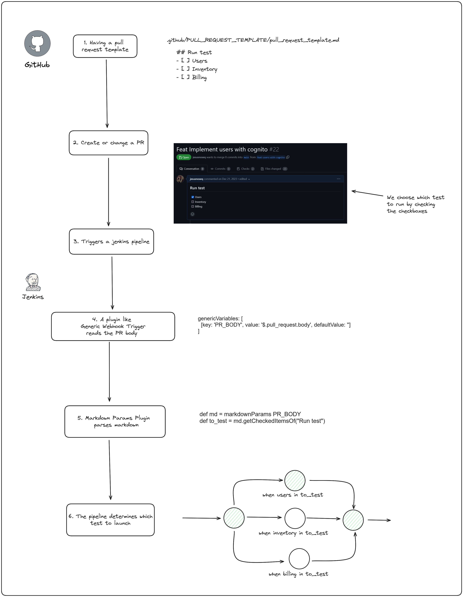

# MarkdownParams

## Introduction

Markdown Params plugin allows Jenkins pipelines to parse Markdown files, extract lists (including checkboxes), and retrieve parameters from them, such as checked or unchecked items. 

This is useful in continuous integration (CI) processes, where Markdown can serve as a task list or selection tool. 

Combined with Jenkins plugins like http_request or generic-webhook-trigger, this enables dynamic control over pipelines based on user-defined inputs, such as deploying microservices marked in pull requests.

### Use case




## Getting started

### Example
```markdown
#### Microservices to deploy
- [x] Auth
- [x] Users
- [ ] Inventory
- [ ] Billing
- [ ] Monitoring
```
#### Pipeline
```groovy
pipeline {
    agent any
    stages {
        stage('Demo') {
            steps {
                script {
                    def md = markdownParams "#### Microservices to deploy\n- [x] Auth\n- [x] Users\n- [ ] Inventory\n- [ ] Billing\n- [ ] Monitoring"
                    def items = md.getCheckedItemsOf("Microservices to deploy")
                    items.each { item ->
                        echo "Deploying ${item}"
                    }
                }
            }
        }
    }
}
```
#### Output
```text
Deploying Auth
Deploying Users
```


## Functions

* getCheckboxItemsOf(String header) → returns a list with all checkbox items in \<header\> section
* getCheckedItemsOf(String header) → returns a list with all checkbox checked items in \<header\> section
* getUncheckedItemsOf(String header) → returns a list with all checkbox unchecked items in \<header\> section
* getUnorderedListItemsOf(String header) → returns a list with all unordered items in \<header\> section
* getOrderedListItemsOf(String header) → returns a list with all ordered items in \<header\> section


## Plugin development

Run and try the example
```shell
mvn hpi:run
```

More details on Jenkins plugin development is available [here](https://wiki.jenkins-ci.org/display/JENKINS/Plugin+tutorial).
Dependencies https://www.jenkins.io/doc/developer/plugin-development/dependency-management/

## Other useful commands
```shell
mvn tidy:pom
```


```shell
mvn clean install
```


```shell
mvn clean verify
```


```shell
mvn versions:update-parent
```

```shell
mvn spotless:apply
```


## Contributing

[Contributing](https://github.com/jenkinsci/.github/blob/master/CONTRIBUTING.md)

[Contribution guidelines](https://github.com/jenkinsci/.github/blob/master/CONTRIBUTING.md)

## LICENSE

Licensed under MIT, see [LICENSE](LICENSE.md)

